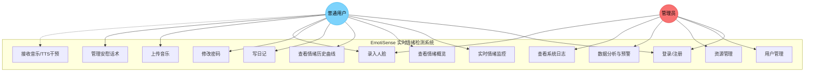

# EmotiSense 系统用例图

## 用例说明

| 编号 | 用例名称 | 参与者 | 说明 |
|------|---------|--------|------|
| UC1 | 登录/注册 | 用户、管理员 | 基于用户名密码的本地认证，角色路由守卫 |
| UC2 | 实时情绪监控 | 用户 | 摄像头感知，实时 MJPEG 视频流 + 情绪标签叠加 |
| UC3 | 查看情绪概览 | 用户 | 首页展示当前心情、个性化推荐、日历热力图 |
| UC4 | 查看情绪历史曲线 | 用户 | 按日/周/月查看心情指数变化趋势 |
| UC5 | 写日记 | 用户 | 新建/编辑/删除日记，绑定情绪标签，支持补打卡 |
| UC6 | 修改密码 | 用户 | 旧密码验证后更新 |
| UC7 | 录入人脸 | 用户、管理员 | 通过摄像头采集人脸特征，管理员可为任意用户录入 |
| UC8 | 上传音乐 | 用户 | 按情绪标签（开心/难过/愤怒/平静）上传 MP3 至个人库 |
| UC9 | 管理安慰话术 | 用户 | 增删个人专属安慰话术 |
| UC10 | 接收干预 | 用户（被动） | 情绪触发时系统自动推送 TTS 语音 + 播放对应情绪音乐 |
| UC11 | 用户管理 | 管理员 | 查看/删除用户及其全部关联数据 |
| UC12 | 资源管理 | 管理员 | 管理全局音乐库和话术库，可为指定用户配置专属资源 |
| UC13 | 数据分析与预警 | 管理员 | 情绪轨迹图（卡尔曼滤波）、高危干预预警台、系统健康度 |
| UC14 | 查看系统日志 | 管理员 | 按用户筛选查看情绪检测历史日志 |
